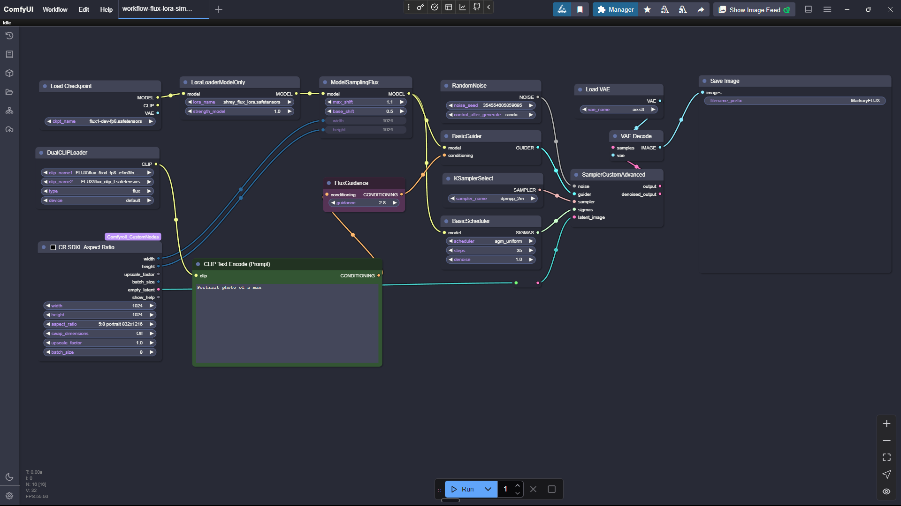
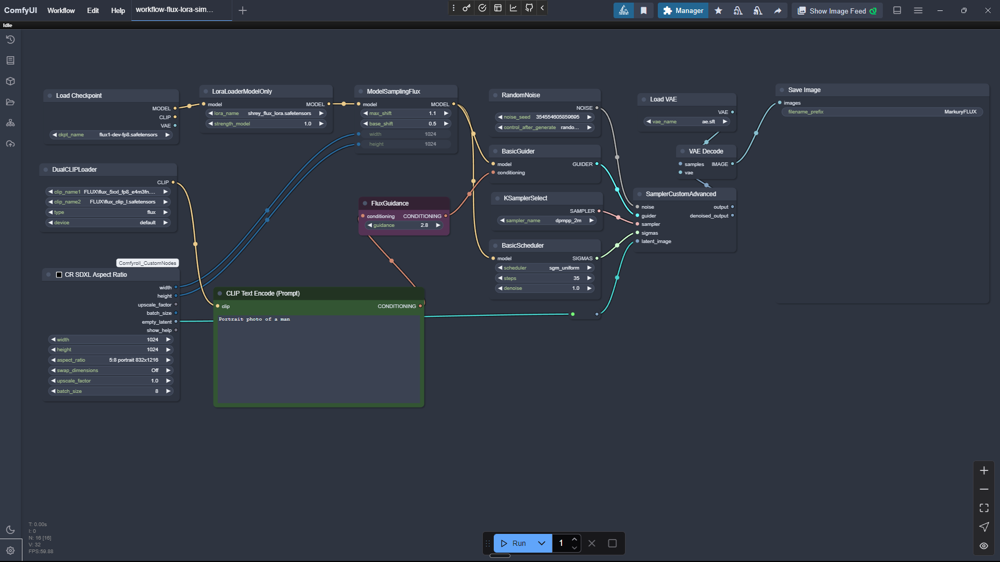
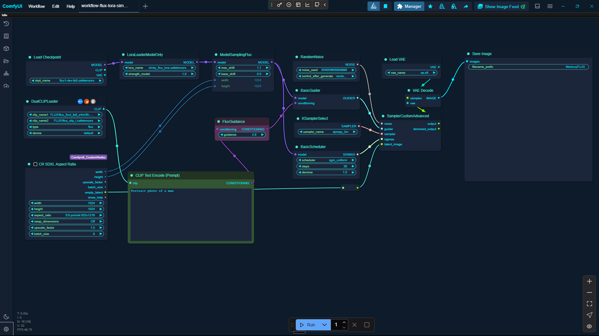
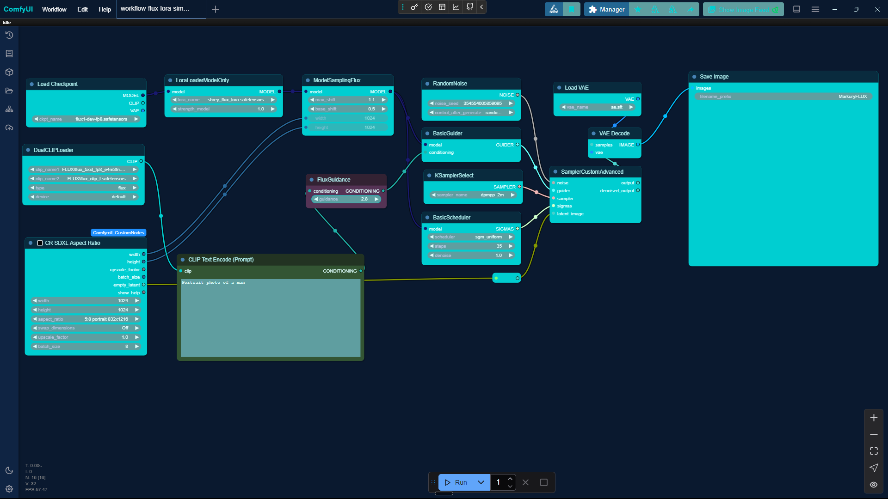

<div align="center">

# 🎨 ComfyUI Color Palettes

[](https://opensource.org/licenses/MIT)
[](https://github.com/shahshrey/ComfyUI-themes/stargazers)
[](https://github.com/shahshrey/ComfyUI-themes/commits/main)

**Customize your ComfyUI experience with a vibrant collection of handcrafted color palettes!**

<p align="center">
  
  <br>
  <em>Dracula Theme Preview</em>
</p>

[Website](https://www.comfyui-themes.com/) • [Features](#-why-use-these-palettes) • [Installation](#-getting-started) • [Themes](#-theme-categories) • [Contribute](#-contributing)

</div>

## 📋 Table of Contents

- [🌐 Online Theme Gallery](#-online-theme-gallery)
- [✨ Why Use These Palettes?](#-why-use-these-palettes)
- [🚀 Getting Started](#-getting-started)
  - [Method 1: Using the Online Gallery](#method-1-using-the-online-gallery-easiest)
  - [Method 2: Using the ComfyUI Settings Menu](#method-2-using-the-comfyui-settings-menu-recommended)
  - [Method 3: Placing the File Manually](#method-3-placing-the-file-manually)
- [📁 Theme Categories](#-theme-categories)
- [🎭 Theme Previews](#-theme-previews)
- [🔧 Structure of a Palette File](#-structure-of-a-palette-file)
- [🤝 Contributing](#-contributing)
- [📄 License](#-license)

---

## 🌐 Online Theme Gallery

Visit our official theme gallery at [comfyui-themes.com](https://www.comfyui-themes.com/) to:
- Browse and preview all available themes in real-time
- Download themes directly through an intuitive interface
- See how each theme looks before installing
- Access the latest theme updates and additions

---

## ✨ Why Use These Palettes?

*   **👁️ Visual Appeal:** Replace the default ComfyUI colors with themes ranging from sleek and professional dark modes to vibrant and playful light modes. Find a style that suits your mood and reduces eye strain during long sessions.
*   **💡 Enhanced Clarity:** Different node types and data connections are assigned distinct colors, making complex workflows easier to read, debug, and understand at a glance.
*   **📂 Organized Collection:** Palettes are meticulously organized into intuitive categories (Dark, Light, Vibrant, Nature, Gradient, Monochrome, Popular), making it simple to browse and find the perfect theme.
*   **🔧 Easy Customization:** Themes are provided as simple JSON files. Feel free to tweak them or use them as a starting point for your own unique creations!

---

## 🚀 Getting Started

<details open>
<summary><b>Quick Install</b></summary>
<br>

```bash
# Clone the repository
git clone https://github.com/shahshrey/ComfyUI-themes.git

# Copy themes to your ComfyUI data directory
cp ComfyUI-themes/themes/**/*.json /path/to/ComfyUI/web/data/
```

</details>

There are three ways to get and apply a theme:

**Method 1: Using the Online Gallery (Easiest)**

1. Visit [comfyui-themes.com](https://www.comfyui-themes.com/)
2. Browse through the available themes
3. Click "Download" on any theme you like
4. Follow either Method 2 or 3 below to apply the downloaded theme

**Method 2: Using the ComfyUI Settings Menu (Recommended)**

1.  **Start ComfyUI:** Launch ComfyUI as usual.
2.  **Open Settings:** Click the gear icon (⚙️) to open the settings panel.
3.  **Navigate to Appearance:** Find and select the "Appearance" section within the settings.
4.  **Load Palette:** Under the "Color Palette" options, click the "Load" button (it might look like an upload icon).
5.  **Select File:** Browse your computer and select the downloaded `.json` theme file you want to apply.
6.  **Apply:** The theme should apply immediately. You might need to close and reopen the settings panel to see the full effect.

**Method 3: Placing the File Manually**

1.  **Download:** Clone this repository or download the ZIP file.
2.  **Browse:** Navigate through the `themes/` directory to explore the different categories and find a palette file (`*-comfy-ui-palette.json`) you like.
3.  **Locate ComfyUI Directory:** Find your ComfyUI installation folder.
4.  **Place the File:** Copy the chosen `.json` palette file into the `ComfyUI/web/data/` directory within your ComfyUI installation.
5.  **Restart ComfyUI:** Close and restart ComfyUI.
6.  **Select Theme:** The new palette should now be available in the ComfyUI settings/options menu (Appearance -> Color Palette dropdown). Select it to apply the new theme.

---

## 📁 Theme Categories

Our collection is organized for easy browsing:

*   `themes/dark/` - For those who prefer the night. 🌃
*   `themes/light/` - Bright and clean interfaces. ☀️
*   `themes/vibrant/` - High-contrast and colorful options. 🌈
*   `themes/nature/` - Inspired by the great outdoors. 🌲🌊
*   `themes/gradient/` - Smooth transitions and sky-like colors. 🌅
*   `themes/monochrome/` - Elegant single-color variations. ⚫⚪
*   `themes/popular/` - Community favorites like Dracula, Nord, and Solarized Dark. ⭐

*(Note: The `popular` folder contains copies of themes found in other categories for convenience.)*

## 🎭 Theme Previews

<div align="center">
  <p float="left">
    
    
    
  </p>
  <em>Nord, Midnight Aurora, and Deep Sea themes</em>
</div>

---

## 🔧 Structure of a Palette File

Each theme follows a specific JSON structure (version `102`):

<details>
<summary><b>Expand to see JSON structure</b></summary>

```json
{
  "version": 102,
  "id": "theme_identifier",      // e.g., "deep_sea"
  "name": "Theme Name",          // e.g., "Deep Sea"
  "description": "Theme description", // A brief description of your theme
  "imageUrl": "/category/preview.png", // Preview image path
  "colors": {
    "node_slot": {
      // Colors for different node connection types
      "CLIP": "#hexcolor",
      "CLIP_VISION": "#hexcolor",
      "CLIP_VISION_OUTPUT": "#hexcolor",
      "CONDITIONING": "#hexcolor",
      "CONTROL_NET": "#hexcolor",
      "IMAGE": "#hexcolor",
      "INT": "#hexcolor",
      "LATENT": "#hexcolor",
      "MASK": "#hexcolor",
      "MODEL": "#hexcolor",
      "PIPE_LINE": "#hexcolor",
      "PIPE_LINE_SDXL": "#hexcolor",
      "STYLE_MODEL": "#hexcolor",
      "TAESD": "#hexcolor",
      "VAE": "#hexcolor",
      "XYPLOT": "#hexcolor",
      "X_Y": "#hexcolor"
    },
    "litegraph_base": {
      // Canvas and node appearance settings
      "BACKGROUND_IMAGE": "",
      "CLEAR_BACKGROUND_COLOR": "#hexcolor",
      "NODE_TITLE_COLOR": "#hexcolor",
      "NODE_SELECTED_TITLE_COLOR": "#hexcolor",
      "NODE_TEXT_SIZE": 14,
      "NODE_TEXT_COLOR": "#hexcolor",
      "NODE_TEXT_HIGHLIGHT_COLOR": "#hexcolor",
      "NODE_SUBTEXT_SIZE": 12,
      "NODE_DEFAULT_COLOR": "rgba(r,g,b,a)",
      "NODE_DEFAULT_BGCOLOR": "rgba(r,g,b,a)",
      "NODE_DEFAULT_BOXCOLOR": "#hexcolor",
      "NODE_DEFAULT_SHAPE": "box",
      "NODE_BOX_OUTLINE_COLOR": "#hexcolor",
      "NODE_BYPASS_BGCOLOR": "#hexcolor",
      "NODE_ERROR_COLOUR": "#hexcolor",
      "DEFAULT_SHADOW_COLOR": "rgba(r,g,b,a)",
      "DEFAULT_GROUP_FONT": 24,
      "WIDGET_BGCOLOR": "#hexcolor",
      "WIDGET_OUTLINE_COLOR": "#hexcolor",
      "WIDGET_TEXT_COLOR": "#hexcolor",
      "WIDGET_SECONDARY_TEXT_COLOR": "#hexcolor",
      "LINK_COLOR": "#hexcolor",
      "EVENT_LINK_COLOR": "#hexcolor",
      "CONNECTING_LINK_COLOR": "#hexcolor",
      "BADGE_FG_COLOR": "#hexcolor",
      "BADGE_BG_COLOR": "#hexcolor"
    },
    "comfy_base": {
      // UI interface colors
      "fg-color": "#hexcolor",
      "bg-color": "#hexcolor",
      "comfy-menu-bg": "rgba(r,g,b,a)",
      "comfy-menu-hover-bg": "rgba(r,g,b,a)",
      "comfy-menu-secondary-bg": "rgba(r,g,b,a)",
      "comfy-input-bg": "#hexcolor",
      "input-text": "#hexcolor",
      "descrip-text": "#hexcolor",
      "drag-text": "#hexcolor",
      "error-text": "#hexcolor",
      "border-color": "#hexcolor",
      "tr-even-bg-color": "rgba(r,g,b,a)",
      "tr-odd-bg-color": "rgba(r,g,b,a)",
      "content-bg": "#hexcolor",
      "content-fg": "#hexcolor",
      "content-hover-bg": "#hexcolor",
      "content-hover-fg": "#hexcolor",
      "bar-shadow": "string" // CSS shadow value
    }
  }
}
```
</details>

## 🤝 Contributing

We welcome theme contributions! Follow these steps to add your own unique palette:

<details>
<summary><b>Contribution Guidelines</b></summary>
<br>

1.  **Create the Theme File:**
    *   Create a new JSON file for your theme.
    *   The filename **must** be the unique identifier (ID) for your theme, using lowercase letters and underscores instead of spaces (e.g., `my_cool_theme.json`).
    *   Follow the structure outlined in the "Structure of a Palette File" section above.
    *   **Required Fields:** Ensure you include `version`, `id`, `name`, `description`, `imageUrl`, and the complete `colors` object.
    *   The `id` field in the JSON **must** match the filename (without `.json`).
    *   The `name` field is the display name (e.g., "My Cool Theme").
    *   The `imageUrl` field **must** follow the format `/category/theme-id.png` (e.g., `/dark/my_cool_theme.png`).

2.  **Prepare the Preview Image:**
    *   Create a preview image for your theme (PNG format is recommended).
    *   Name the image file exactly like your theme's ID (e.g., `my_cool_theme.png`).
    *   Place this image in the corresponding category folder within the `public/` directory. For example, if your theme is a dark theme with the ID `my_cool_theme`, the image path would be `public/dark/my_cool_theme.png`.

3.  **Place the Theme File:**
    *   Determine the appropriate category for your theme (e.g., `dark`, `light`, `vibrant`).
    *   Place your theme's JSON file inside the corresponding category folder within the `themes/` directory. For example: `themes/dark/my_cool_theme.json`.

4.  **Test Your Theme:**
    *   Load your theme file in ComfyUI (using the Settings menu or by placing it in `ComfyUI/web/data/`) to ensure it loads correctly and all elements are styled as expected.
    *   Verify colors have sufficient contrast and are visually appealing.

5.  **Submit a Pull Request:**
    *   Fork the repository.
    *   Commit your new theme JSON file and preview image.
    *   Create a Pull Request (PR) back to the main repository.
    *   **Important:** Include a screenshot of your theme applied in ComfyUI within the PR description.

**Color Guidelines:**
- Use hex codes (`#RRGGBB`) for solid colors.
- Use `rgba(r,g,b,a)` for colors requiring transparency (e.g., backgrounds, shadows).
- Ensure sufficient contrast between text and background colors for readability.
- Test your theme's appearance in various node setups.

</details>

---

## 📄 License

This project is licensed under the MIT License - see the [LICENSE](https://opensource.org/licenses/MIT) file for details. 

<div align="center">
  <br>
  <p>
    <a href="https://github.com/shahshrey/ComfyUI-themes/stargazers">
      ⭐ Star us on GitHub — it helps!
    </a>
  </p>
</div> 